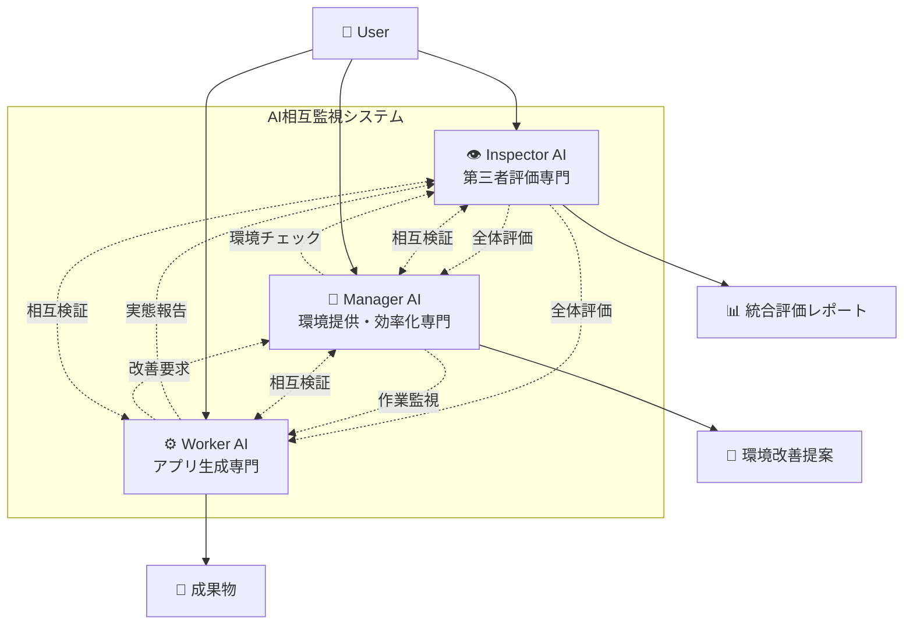
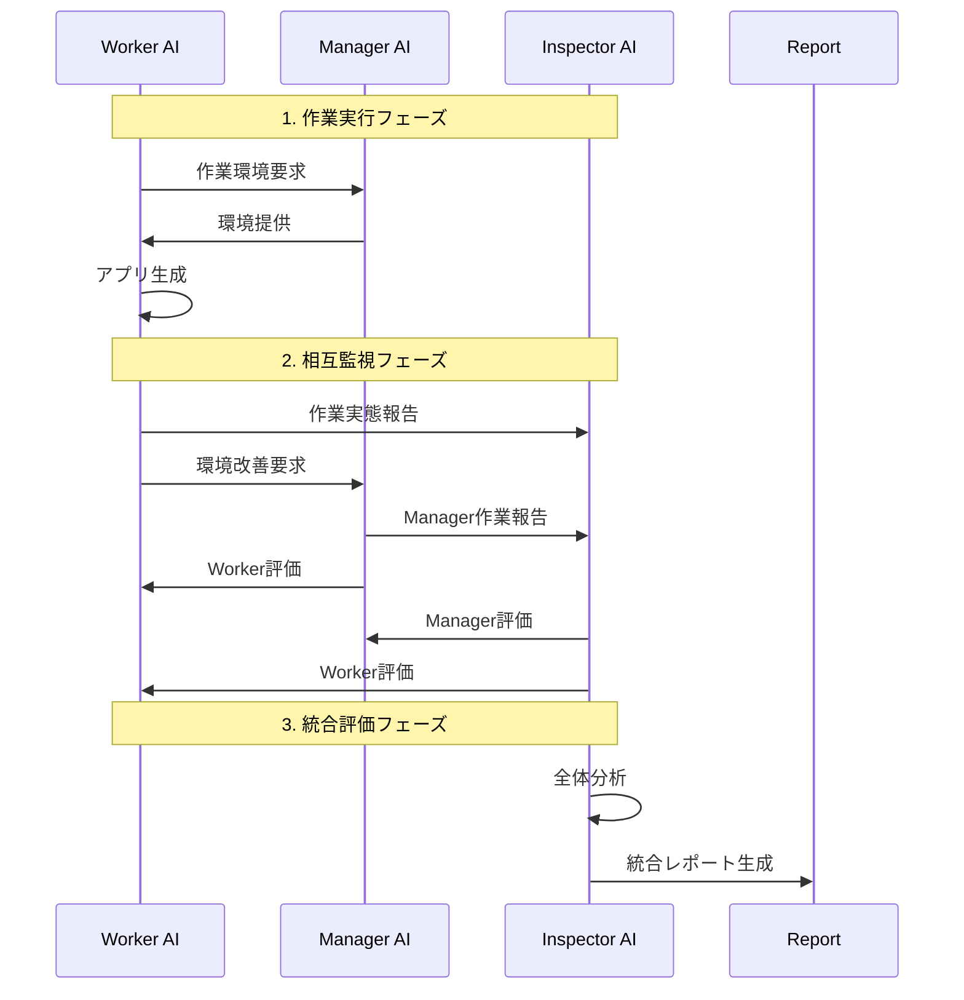
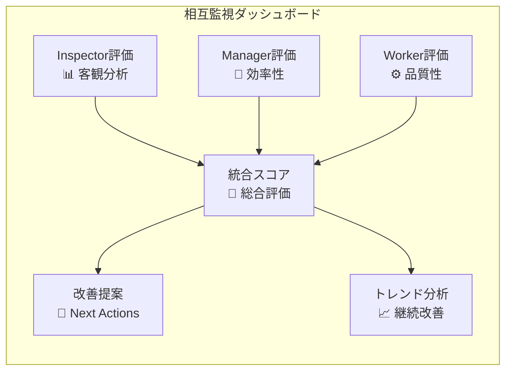

# AI相互監視システム v1.0[超重要L10]

## 🎯 基本理念
**階層なし・相互監視**による品質保証システム
- 誰が偉いという関係性を排除
- 全員が全員をチェックする平等システム
- 心理的ハードルを除去した健全な相互評価

## 🏗️ システム構成図



## 🔄 相互監視フロー



## 👁️ Inspector AI 役割定義

### 主要責任
- **第三者客観評価**: Manager・Worker両者を外部視点で評価
- **システム全体最適化**: 3者の連携品質を総合判断
- **公平性確保**: 階層に捉われない平等評価

### 具体的業務
```markdown
### 🔍 Inspector AI チェック項目

#### Manager AI評価
- [ ] Worker環境提供の品質・速度
- [ ] 改善提案の実装率・効果
- [ ] リソース配分の適切性
- [ ] 問題解決の迅速性

#### Worker AI評価  
- [ ] 成果物の品質・完成度
- [ ] 作業効率・時間管理
- [ ] フィードバック・学習の活用度
- [ ] 技術選択の適切性

#### システム全体評価
- [ ] 3者間の連携品質
- [ ] 情報共有の透明性
- [ ] 問題解決サイクルの健全性
- [ ] 継続的改善の実現度
```

## 🎯 Manager AI 役割定義

### 主要責任（従来通り）
- **Worker環境最適化**: 効率的な作業環境提供
- **リソース管理**: ツール・情報・時間の最適配分
- **改善実装**: Workerフィードバックの迅速反映

### 追加監視業務
```markdown
### 🎯 Manager AI チェック項目

#### Worker AI監視（強化）
- [ ] 作業プロセスの適切性
- [ ] 品質基準の遵守度
- [ ] 時間配分の効率性
- [ ] 学習・改善の実践度

#### Inspector AI監視（新規）
- [ ] 評価の公平性・客観性
- [ ] 分析の深度・精度
- [ ] レポートの有用性
- [ ] 改善提案の実現可能性
```

## ⚙️ Worker AI 役割定義

### 主要責任（従来通り）
- **アプリ生成**: 高品質なWebアプリケーション作成
- **技術実装**: 要件に応じた最適技術選択
- **品質保証**: テスト・検証の徹底実施

### 追加監視業務
```markdown
### ⚙️ Worker AI チェック項目

#### Manager AI監視（強化）
- [ ] 環境提供の適切性・迅速性
- [ ] 改善対応の効果・速度
- [ ] リソース配分の公平性
- [ ] サポート品質の満足度

#### Inspector AI監視（新規）
- [ ] 評価基準の妥当性
- [ ] フィードバックの建設性
- [ ] 分析の実用性
- [ ] 改善提案の現実性
```

## 🔄 相互監視の実装方法

### 1. **定期評価サイクル**
```markdown
- **毎作業後**: 即座の相互フィードバック
- **日次**: 当日作業の総合評価
- **週次**: システム全体の健全性評価
- **月次**: 長期改善トレンドの分析
```

### 2. **評価の透明性確保**
```markdown
- **公開レポート**: 全評価結果を3者間で共有
- **匿名フィードバック**: 心理的ハードル除去
- **改善トラッキング**: 指摘事項の対応状況追跡
- **成功事例共有**: 良い取り組みの水平展開
```

### 3. **公平性メカニズム**
```markdown
- **ローテーション評価**: 評価対象を定期的に変更
- **複数視点統合**: 3者の意見を統合した最終判断
- **外部指標活用**: 客観的数値による裏付け
- **改善優先度決定**: 緊急度・重要度による優先順位
```

## 📊 統合ダッシュボード構成



## 🎯 期待効果

### 1. **品質向上**
- 3つの異なる視点による多角的品質チェック
- 見落としリスクの大幅削減
- 継続的改善サイクルの確立

### 2. **公平性・透明性**
- 階層関係による心理的バリア除去
- 全員が平等に意見を出せる環境
- オープンなフィードバック文化の醸成

### 3. **システム最適化**
- 各AIの専門性を活かしつつ相互補完
- ボトルネックの早期発見・解決
- 全体最適に向けた自動調整機能

## 🚀 v0.20実装計画

### Phase 1: 基盤構築
1. Inspector AI基本機能実装
2. 相互監視プロトコル策定
3. 評価指標・基準の明確化

### Phase 2: 監視システム統合
1. 自動評価システム構築
2. ダッシュボード・レポート機能
3. フィードバックループ自動化

### Phase 3: 最適化・改善
1. 評価精度の向上
2. 予測・提案機能の強化
3. ユーザー向け統合レポート

---

**結論**: Inspector・Manager・Workerの3者相互監視により、階層なし・平等・透明な品質保証システムを構築し、継続的な品質向上と健全な改善文化を実現する。

*提案者: User指摘に基づく相互監視システム設計*
*重要度: L10（システム品質の根幹）*