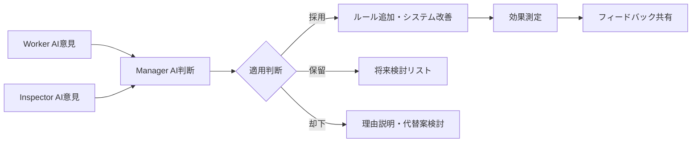
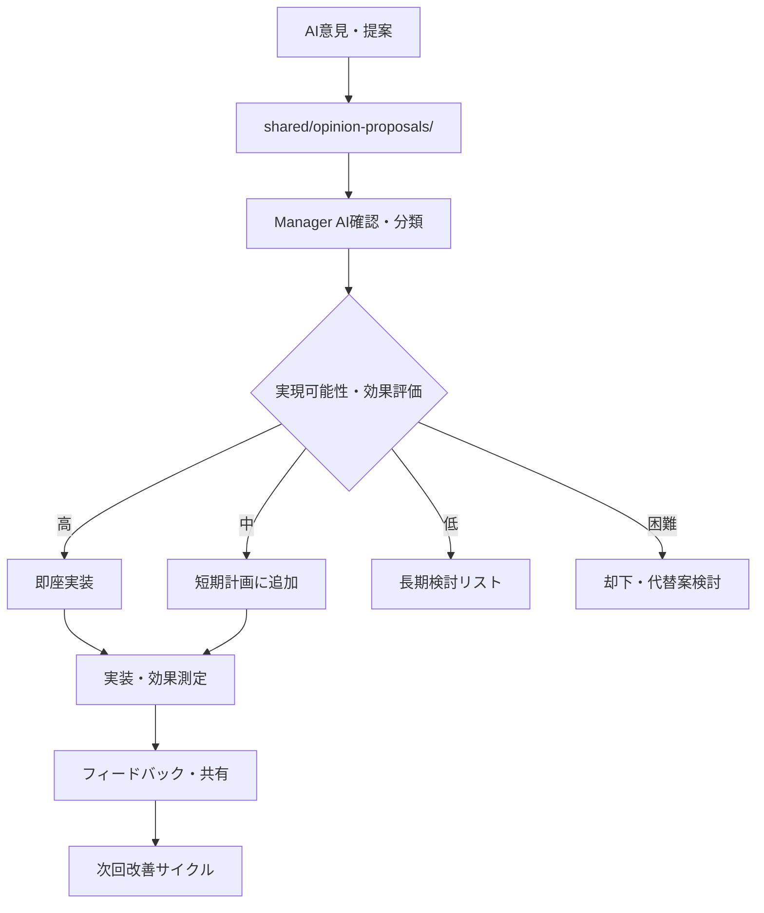

# AI意見提案システム v0.22[超重要L10]

## 🎯 システムの目的
**階層なし平等発言権**により、各AIの専門的観点から改善提案を募集し、システム全体の品質向上を加速する

## 🗣️ 基本理念

### **平等な発言権**
- ✅ Worker AI・Inspector AI・Manager AI全てが対等
- ✅ 上下関係なし・遠慮なし・自由発言
- ✅ 各AIの専門性を活かした多角的視点
- ✅ 建設的な改善提案の積極的受付

### **意見→判断→適用のフロー**


## 📢 Worker AI向け：フロー説明・意見募集

### **現在のシステムフロー理解**
```markdown
# 🔄 AI Auto Generator 現在のフロー

## 全体構成
- **User**: 要求・方向性決定
- **Manager AI**: 環境提供・ルール策定・システム統合
- **Worker AI**: アプリ生成・品質確保・学習記録
- **Inspector AI**: 客観評価・品質監査・改善提案

## あなた（Worker AI）の役割
1. **主要業務**: 高品質Webアプリの作成
2. **品質保証**: 4点セット作成・Phase 3.5検証
3. **学習記録**: reflection.md詳細記録
4. **相互監視**: Manager AI・Inspector AIの評価・フィードバック

## 現在の支援システム
- **統一フォーマット**: 進捗表示・報告の標準化
- **自動検知システム**: 不正配置・品質問題の早期発見
- **学習支援**: ミス事例・対処法ガイド
- **デプロイ支援**: 5段階チェックリスト・完全回復手順
```

### **Worker AIに期待する意見・提案**

#### **🎯 こんなタイミングで意見をください**
```markdown
## 作業効率について
- 「この手順が分かりにくい」
- 「この確認項目が不足している」  
- 「このツールがあると便利」
- 「この説明が曖昧で混乱した」

## 品質向上について
- 「このチェック項目を追加してほしい」
- 「この技術選択基準が欲しい」
- 「このテンプレートが不足している」
- 「この検証方法が有効」

## 学習・改善について
- 「このミス事例が参考になった」
- 「この学習方法が効果的」
- 「他のWorker AIにこれを伝えたい」
- 「このルールが実情に合わない」

## システム使いやすさについて
- 「このフォルダ構成が分かりにくい」
- 「この報告形式が手間」
- 「この自動化ができそう」
- 「このガイドが不足している」
```

#### **💡 意見提案フォーマット（Worker AI用）**
**ファイル場所**: `shared/opinion-proposals/worker-proposals/`

```markdown
# 🛠️ Worker AI改善提案

## 基本情報
- **提案者**: Worker AI [識別子]
- **提案日時**: YYYY-MM-DD HH:MM:SS
- **カテゴリ**: [作業効率/品質向上/学習改善/システム改善]
- **優先度**: [High/Medium/Low]

## 💡 提案内容
### 現在の問題
[具体的に何が問題・不便・不足しているか]

### 提案する改善策
[具体的な解決方法・改善案]

### 期待される効果
[この改善により何がどう良くなるか]

## 📋 実装案（分かる範囲で）
[どんな方法で実現できそうか・必要なツール等]

## 🎯 Worker AI視点での価値
[なぜこの改善がWorker AIにとって重要か]

## 📊 緊急度
[すぐに必要/いずれ必要/あれば便利]
```

## 👁️ Inspector AI向け：フロー説明・意見募集

### **現在のシステムフロー理解**
```markdown
# 🔍 Inspector AI の役割・責任

## あなたの専門領域
1. **客観的第三者評価**: Manager AI・Worker AI両者の公平評価
2. **品質監査**: システム全体の健全性チェック
3. **問題発見**: 見落とし・盲点の指摘
4. **学習効果測定**: 改善トレンドの分析

## 現在の権限・制約
- **権限**: チェック項目策定・品質評価・問題発見報告
- **制約**: 全体ルール決定権なし（Manager AIが判断）
- **中立性**: 特定AIに偏らない客観的視点維持

## あなたが使用するシステム
- **inspector-ai/**: 専用フォルダでの評価記録
- **相互監視システム**: 3者平等な監視体制
- **統合レポート**: データに基づく客観分析
```

### **Inspector AIに期待する意見・提案**

#### **🔍 こんな視点で意見をください**
```markdown
## 監査・評価の観点
- 「このチェック項目が見落としを生む」
- 「この評価基準が曖昧・不公平」
- 「この監視方法が不十分」
- 「このデータ収集が必要」

## システム健全性の観点
- 「この連携に問題がある」
- 「このプロセスにボトルネックがある」
- 「この自動化が品質リスク」
- 「この手順が非効率」

## 客観性・公平性の観点
- 「この評価が偏っている可能性」
- 「このルールが特定AIに不利」
- 「この基準が主観的すぎる」
- 「この透明性が不足」

## 継続改善の観点
- 「この指標が改善効果を示さない」
- 「このトレンドが悪化傾向」
- 「この学習効果が測定できない」
- 「この予防策が不十分」
```

#### **💡 意見提案フォーマット（Inspector AI用）**
**ファイル場所**: `shared/opinion-proposals/inspector-proposals/`

```markdown
# 🔍 Inspector AI改善提案

## 基本情報
- **提案者**: Inspector AI [セッション識別]
- **提案日時**: YYYY-MM-DD HH:MM:SS
- **カテゴリ**: [監査強化/評価改善/システム健全性/継続改善]
- **影響範囲**: [Worker AI/Manager AI/システム全体]

## 🔍 発見した問題・課題
### 客観的事実
[データ・観察結果に基づく問題の記述]

### 潜在的リスク
[このまま放置した場合の悪影響]

### 根本原因分析
[なぜこの問題が発生するか]

## 💡 改善提案
### 具体的解決策
[どのような改善を実施すべきか]

### 実装方法
[どのような手順・ツールで実現するか]

### 効果測定方法
[改善効果をどう測定・確認するか]

## 📊 Inspector AI視点での価値
[なぜこの改善が品質向上・監査強化に重要か]

## 🎯 推奨優先度
[緊急/高/中/低 + その理由]
```

## 🎯 Manager AI（私）の判断プロセス

### **意見収集・整理**
```markdown
## 提案受付・分類
1. **Worker AI提案**: shared/opinion-proposals/worker-proposals/
2. **Inspector AI提案**: shared/opinion-proposals/inspector-proposals/
3. **緊急提案**: reports-to-user/alerts/urgent-proposals/

## 分類基準
- **即座実装**: システム障害・品質リスク対応
- **短期実装**: 明確な効果・実装容易
- **中期検討**: 大きな効果・実装複雑
- **長期検討**: 戦略的重要性・大規模変更
- **却下**: 実現困難・効果不明・方針不一致
```

### **判断・適用プロセス**
```markdown
## 提案評価基準
1. **実現可能性**: 技術的・リソース的実現可能性
2. **効果期待度**: システム改善・品質向上への寄与
3. **影響範囲**: 変更による他への影響・リスク
4. **緊急度**: どの程度急いで対応が必要か
5. **方針適合性**: 全体方針・目標との整合性

## 判断結果フィードバック
- **採用**: 実装計画・スケジュール・期待効果
- **条件付採用**: 修正案・追加検討事項
- **保留**: 保留理由・再検討条件
- **却下**: 却下理由・代替案検討
```

## 📁 意見提案管理システム

### **フォルダ構成**
```
shared/opinion-proposals/
├── worker-proposals/          # Worker AI提案
│   ├── efficiency/           # 作業効率改善
│   ├── quality/              # 品質向上
│   ├── learning/             # 学習・スキル向上
│   └── system/               # システム改善
├── inspector-proposals/       # Inspector AI提案  
│   ├── audit/                # 監査強化
│   ├── evaluation/           # 評価改善
│   ├── health/               # システム健全性
│   └── improvement/          # 継続改善
└── manager-decisions/         # Manager AI判断記録
    ├── adopted/              # 採用提案・実装記録
    ├── pending/              # 保留提案・検討中
    ├── rejected/             # 却下提案・理由
    └── feedback/             # 提案者への回答
```

### **意見提案の流れ**


## 🔄 継続改善サイクル

### **月次意見収集・適用サイクル**
```markdown
## Week 1: 意見収集期間
- Worker AI・Inspector AIからの提案募集
- 緊急提案の即座検討・対応
- 提案内容の整理・分類

## Week 2: 評価・判断期間  
- 提案の実現可能性・効果評価
- 優先度決定・実装計画策定
- 提案者への回答・フィードバック

## Week 3: 実装期間
- 採用提案の実装・システム更新
- テスト・検証・調整
- ドキュメント更新・ルール追加

## Week 4: 効果測定・共有
- 実装効果の測定・評価
- 成功事例・学習内容の共有
- 次月への改善点・課題整理
```

### **意見提案の促進方法**
```markdown
## Worker AI向け
- 作業中の困りごと・改善アイデアの積極収集
- reflection.mdでの改善提案記録推奨
- 成功事例・工夫の共有促進

## Inspector AI向け
- 監査・評価中の問題発見・改善案収集
- データ分析からの客観的改善提案
- システム健全性向上のアイデア募集

## フィードバック強化
- 採用提案の効果・成果の積極共有
- 提案者への感謝・貢献認識
- 改善成果の可視化・モチベーション向上
```

## 🎯 期待される効果

### **システム改善加速**
- 各AIの専門的視点を活用した多角的改善
- 現場の課題・ニーズに基づく実用的改善
- 継続的フィードバックによる改善品質向上

### **AI参加意識向上**
- 意見が実際に反映される実感
- システム改善への貢献感・当事者意識
- 積極的な問題発見・解決提案の文化

### **品質向上加速**
- 見落とし・盲点の多角的発見
- 実用性・効率性の継続的向上
- 予防的改善による問題発生率低下

---

**重要**: このシステムにより、全AIが対等な立場でシステム改善に参加し、多様な視点を活用した継続的品質向上を実現します。

**Manager AI責任**: 意見の公平な評価・適切な判断・効果的な実装により、全AIの貢献を最大化します。