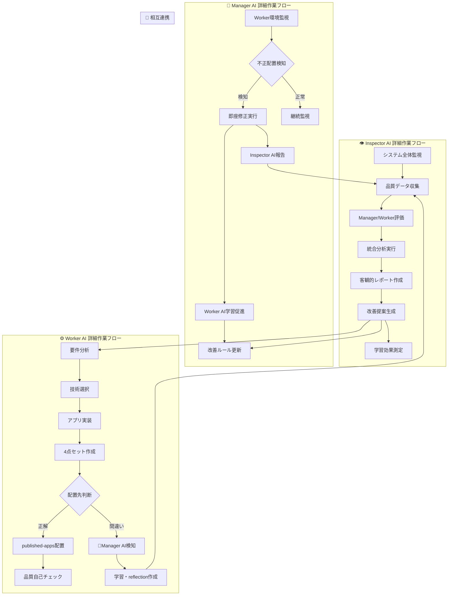

# 自動修正プロトコル v0.21[超重要L10]

## 🎯 役割分担の確定

### **Manager AI**: 修正作業担当 ✅
- **責務**: 不正配置の即座修正実行
- **権限**: フォルダ移動・リポジトリ管理
- **作業範囲**: 環境整備・Worker AIサポート

### **Worker AI**: 学習・再発防止 📚  
- **責務**: ミス原因のreflection作成
- **作業**: 正しいルールの学習・記録
- **制約**: 修正作業は行わない（Manager AIに委ねる）

### **Inspector AI**: 検知・監査専門 👁️
- **責務**: 不正配置の発見・報告
- **作業**: 修正品質確認・学習効果測定
- **制約**: チェック専門、実作業は行わない

## 🔧 Manager AI自動修正フロー

### Phase 1: 不正配置検知
```bash
# 管理フォルダ内のapp-*検索
MISPLACED_APPS=$(find . -maxdepth 2 -name "app-*" -type d | grep -v temp-deploy | grep -v tools)

if [ -n "$MISPLACED_APPS" ]; then
    echo "🚨 不正配置アプリ検知:"
    echo "$MISPLACED_APPS"
fi
```

### Phase 2: 即座修正実行
```bash
for app_dir in $MISPLACED_APPS; do
    APP_ID=$(basename "$app_dir")
    echo "🔧 $APP_ID 修正開始..."
    
    # 1. published-apps存在確認
    if [ ! -d "../published-apps" ]; then
        echo "❌ published-apps not found"
        continue
    fi
    
    # 2. 安全移動
    mv "$app_dir" "../published-apps/"
    echo "✅ $APP_ID → published-apps 移動完了"
    
    # 3. 必須ファイル確認
    echo "📋 必須ファイル確認:"
    for file in reflection.md requirements.md work_log.md index.html; do
        if [ -f "../published-apps/$APP_ID/$file" ]; then
            echo "  ✅ $file"
        else
            echo "  ❌ $file (欠如)"
        fi
    done
done
```

### Phase 3: Worker AI通知・学習促進
```bash
# Worker AIに学習を促すメッセージ生成
cat > misplacement-learning-prompt.md << EOF
# 🚨 配置ミス発生 - 学習が必要

## 検知された問題
- アプリID: $APP_ID
- 誤った配置: ai-auto-generator/$APP_ID
- 正しい配置: published-apps/$APP_ID

## Worker AIへの学習課題
1. なぜ間違った場所に配置したのか？
2. 正しい配置ルールの再確認
3. Phase 3.5検証の徹底
4. 4点セット(index.html + reflection.md + requirements.md + work_log.md)必須

## reflection.mdに記録すべき内容
- 配置ミスの原因分析
- 正しいフォルダ構造の理解
- 今後の防止策
EOF
```

### Phase 4: Inspector AI報告
```bash
# Inspector AIに修正完了を報告
echo "📊 Inspector AIへの報告:"
echo "  修正完了アプリ: $APP_ID"
echo "  修正時刻: $(date)"
echo "  残課題: 必須ファイル欠如の解決"
```

## 📊 v0.21 Mermaid図詳細化

### 現在の問題
- 作業内容が抽象的
- 具体的な手順が不明
- 責任範囲が曖昧

### v0.21での改善


## 🎯 具体的実装計画

### Manager AI自動修正機能
```javascript
// management-ai-auto-corrector.cjs (新規作成)
class AutoCorrector {
    async detectAndCorrectMisplacements() {
        const misplacedApps = await this.detectMisplacedApps();
        
        for (const app of misplacedApps) {
            await this.correctPlacement(app);
            await this.notifyWorkerAI(app);
            await this.reportToInspector(app);
        }
    }
    
    async correctPlacement(appInfo) {
        // 1. 安全性チェック
        if (!this.isValidApp(appInfo)) return false;
        
        // 2. 移動実行
        const success = await this.moveToCorrectLocation(appInfo);
        
        // 3. 移動後検証
        if (success) {
            await this.verifyCorrection(appInfo);
        }
        
        return success;
    }
}
```

### Worker AI学習強化
```markdown
# Worker AI配置ルール (強化版)

## 絶対ルール
1. **Published Apps**: ../published-apps/ (完成品)
2. **管理フォルダ**: ai-auto-generator/ (appフォルダ禁止)
3. **一時フォルダ**: temp-deploy/ (作業中のみ)

## 4点セット必須
- index.html (メインファイル)
- reflection.md (振り返り)
- requirements.md (要件)
- work_log.md (作業ログ)

## 確認手順
1. 配置前にフォルダパス確認
2. 4点セット作成確認  
3. Phase 3.5検証実行
4. Manager AI環境チェック待機
```

## 📈 効果測定・継続改善

### 成功指標
- **配置ミス**: 月次0件達成
- **検知時間**: 24時間以内100%
- **修正時間**: 検知から1時間以内
- **学習効果**: Worker AIの改善率測定

### 継続改善サイクル
1. **週次**: 修正実績・学習効果の評価
2. **月次**: システム改善・ルール更新
3. **四半期**: 全体的な品質向上度測定

---

**実装バージョン**: v0.21
**責任者**: Manager AI (修正実行) + Inspector AI (品質監査)
**Worker AI**: 学習・再発防止専念