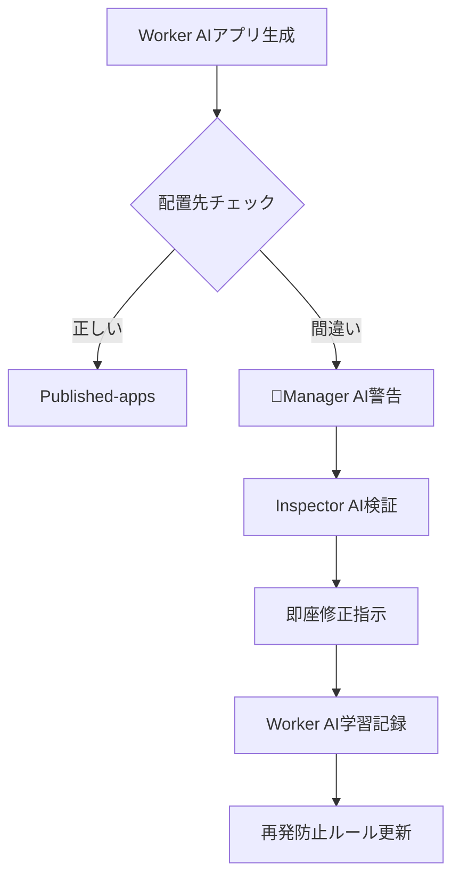

# 不正配置アプリ検知・修正システム[超重要L10]

## 🚨 検知された問題

### **app-0000004-wssf74** 不正配置
- **問題**: ai-auto-generator直下に配置（管理フォルダ汚染）
- **正解**: published-apps リポジトリに配置すべき
- **不足**: reflection.md・requirements.md・work_log.md完全欠如
- **影響**: 追跡不可能・品質検証不可能

## 🎯 Manager・Inspector協力フロー



## 🔍 自動検知システム

### Phase 1: Manager AI監視
```bash
# 管理フォルダ内の不正app検知
find /ai-auto-generator -maxdepth 2 -name "app-*" -type d | grep -v temp-deploy | grep -v tools

# 結果例
./app-0000004-wssf74  # ← 不正配置！
```

### Phase 2: Inspector AI検証
```bash
# 必須ファイル存在チェック
for app_dir in $(find . -name "app-*" -type d); do
    echo "📂 $app_dir:"
    echo "  reflection.md: $(test -f "$app_dir/reflection.md" && echo "✅" || echo "❌")"
    echo "  requirements.md: $(test -f "$app_dir/requirements.md" && echo "✅" || echo "❌")"  
    echo "  work_log.md: $(test -f "$app_dir/work_log.md" && echo "✅" || echo "❌")"
    echo "  index.html: $(test -f "$app_dir/index.html" && echo "✅" || echo "❌")"
done
```

### Phase 3: 即座修正
```bash
# 不正配置アプリの安全移動
APP_ID="app-0000004-wssf74"
SOURCE_DIR="./app-0000004-wssf74"
TARGET_REPO="../published-apps"

# 1. 移動先準備
if [ ! -d "$TARGET_REPO" ]; then
    echo "❌ published-apps リポジトリが見つかりません"
    exit 1
fi

# 2. 必須ファイル欠如警告
echo "⚠️ 以下のファイルが欠如しています:"
test ! -f "$SOURCE_DIR/reflection.md" && echo "  - reflection.md"
test ! -f "$SOURCE_DIR/requirements.md" && echo "  - requirements.md"  
test ! -f "$SOURCE_DIR/work_log.md" && echo "  - work_log.md"

# 3. 安全移動
mv "$SOURCE_DIR" "$TARGET_REPO/"
echo "✅ $APP_ID を published-apps に移動完了"
```

## 🔄 根本原因追跡システム

### Worker AI行動分析
```markdown
## 🔍 app-0000004-wssf74 ミス分析

### 推定される問題
1. **配置先判断ミス**: 
   - 正解: published-apps リポジトリ
   - 実際: ai-auto-generator直下
   
2. **必須ファイル生成忘れ**:
   - reflection.md: 未作成
   - requirements.md: 未作成
   - work_log.md: 未作成

3. **品質チェック未実施**:
   - Phase 3.5検証をスキップ？
   - worker-quality-validator.cjs未実行？

### 学習ポイント
- Published Apps = ../published-apps リポジトリ
- 管理フォルダ = ai-auto-generator (appフォルダ禁止)
- 4点セット必須: index.html + reflection.md + requirements.md + work_log.md
```

## 🛡️ 再発防止メカニズム

### 1. **自動チェックポイント追加**
```javascript
// worker-quality-validator.cjs に追加
async function validateAppPlacement(appId, deploymentDir) {
    const check = {
        name: 'App Placement Validation',
        passed: false,
        issues: []
    };
    
    // ai-auto-generator直下チェック
    if (deploymentDir.includes('ai-auto-generator') && 
        !deploymentDir.includes('temp-deploy')) {
        check.issues.push({
            type: 'wrong_repository_placement',
            severity: 'critical',
            description: '管理フォルダにアプリが配置されています',
            correctLocation: '../published-apps/',
            currentLocation: deploymentDir
        });
    }
    
    // 必須ファイルチェック
    const requiredFiles = ['index.html', 'reflection.md', 'requirements.md', 'work_log.md'];
    requiredFiles.forEach(file => {
        if (!fs.existsSync(path.join(deploymentDir, file))) {
            check.issues.push({
                type: 'missing_required_file',
                severity: 'critical',
                description: `必須ファイルが欠如: ${file}`,
                file: file
            });
        }
    });
    
    check.passed = check.issues.length === 0;
    return check;
}
```

### 2. **Manager AI監視強化**
```javascript
// management-ai-monitor.cjs に追加
async function detectMisplacedApps() {
    const managementDir = '/mnt/c/Users/user/ai-auto-generator';
    const misplacedApps = [];
    
    // 管理フォルダ内のapp-*検索
    const entries = fs.readdirSync(managementDir);
    entries.forEach(entry => {
        if (entry.startsWith('app-') && entry.match(/app-\d{7}-[a-z0-9]+/)) {
            misplacedApps.push({
                appId: entry,
                wrongLocation: path.join(managementDir, entry),
                correctLocation: '../published-apps/',
                detectedAt: new Date().toISOString()
            });
        }
    });
    
    return misplacedApps;
}
```

### 3. **Inspector AI定期監査**
```markdown
### Inspector AI 不正配置監査チェックリスト

#### 毎作業後チェック
- [ ] ai-auto-generator直下にapp-*フォルダなし
- [ ] temp-deploy内のアプリは一時的のみ
- [ ] published-appsに正しく配置されているか

#### 週次監査
- [ ] 過去1週間の配置ミス件数
- [ ] Worker AI学習効果の測定
- [ ] 再発防止策の効果検証

#### 月次分析
- [ ] 配置ミス傾向分析
- [ ] Worker AI改善トレンド
- [ ] システム健全性評価
```

## 🔧 即座実行アクション

### 1. **app-0000004-wssf74緊急対処**
```bash
#!/bin/bash
# 不正配置アプリ緊急修正スクリプト

APP_ID="app-0000004-wssf74"
echo "🚨 $APP_ID 緊急修正開始"

# 現状確認
echo "📍 現在の配置: ai-auto-generator/$APP_ID"
echo "📍 正しい配置: published-apps/$APP_ID"

# 必須ファイル確認
echo "📋 ファイル確認:"
ls -la "$APP_ID/"

# published-appsディレクトリ確認
if [ -d "../published-apps" ]; then
    echo "✅ published-apps リポジトリ確認"
    
    # 移動実行
    mv "$APP_ID" "../published-apps/"
    echo "✅ $APP_ID を published-apps に移動完了"
    
    # 移動確認
    ls -la "../published-apps/$APP_ID/"
    
else
    echo "❌ published-apps リポジトリが見つかりません"
    echo "📍 手動で以下を実行してください:"
    echo "   mv $APP_ID ../published-apps/"
fi

echo "⚠️ 注意: reflection.md, requirements.md, work_log.md が欠如しています"
echo "📝 Worker AI に追加作成を依頼してください"
```

### 2. **システム改善実装**
- worker-quality-validator.cjs にapp配置検証追加
- management-ai-monitor.cjs に不正配置検知追加
- inspector評価項目に配置監査追加

### 3. **Worker AI学習強化**
- 配置ルールの明確化
- 4点セット必須の徹底
- Phase 3.5検証の強制実行

## 📊 効果測定指標

### 成功指標
- **配置ミス件数**: 月次ゼロ件達成
- **必須ファイル欠如**: 月次ゼロ件達成
- **早期検知率**: 24時間以内100%検知
- **修正速度**: 検知から修正まで1時間以内

### 継続改善
- Worker AI学習曲線の追跡
- 自動化システムの精度向上
- 予防メカニズムの強化

---

**緊急度**: 最高（システム品質に直結）
**責任者**: Manager AI + Inspector AI協力体制
**実装期限**: 即座実行