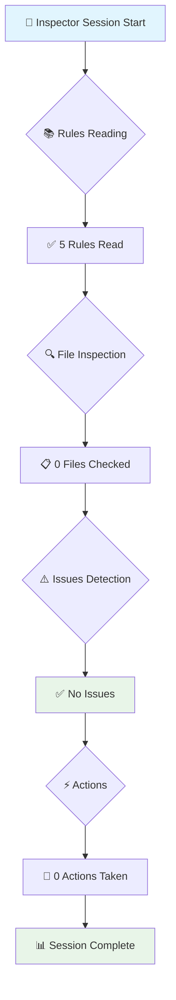

# Inspector AI Session Visualization

## inspector-session-1753567956430
**実行時刻**: 2025/7/27 7:12:36

## 📊 Performance Metrics

| Metric | Value | Status |
|--------|-------|--------|
| Rules Read | 5 | ✅ |
| Files Checked | 0 | ✅ |
| Validations | 0 | ✅ |
| Issues Found | 0 | ✅ |
| Changes Detected | 5 | 📝 |
| Actions Taken | 0 | ✅ |

