# Inspector AI Session Visualization

## inspector-session-1753569234065
**実行時刻**: 2025/7/27 7:33:54

```mermaid
graph TD
    A[🚀 Inspector Session Start] --> B{📚 Rules Reading}
    B --> C[✅ 10 Rules Read]
    C --> D{🔍 File Inspection}
    D --> E[📋 0 Files Checked]
    E --> F{⚠️ Issues Detection}
    
    F --> H[✅ No Issues]
    H --> I{⚡ Actions}
    
    I --> J[🎯 0 Actions Taken]
    J --> K[📊 Session Complete]
    
    style A fill:#e1f5fe
    style K fill:#e8f5e8
    style H fill:#e8f5e8
```

## 📊 Performance Metrics

| Metric | Value | Status |
|--------|-------|--------|
| Rules Read | 10 | ✅ |
| Files Checked | 0 | ✅ |
| Validations | 0 | ✅ |
| Issues Found | 0 | ✅ |
| Changes Detected | 0 | ✅ |
| Actions Taken | 0 | ✅ |

