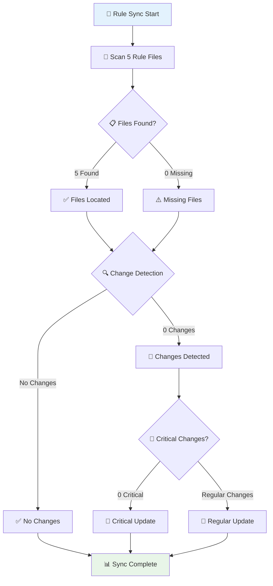
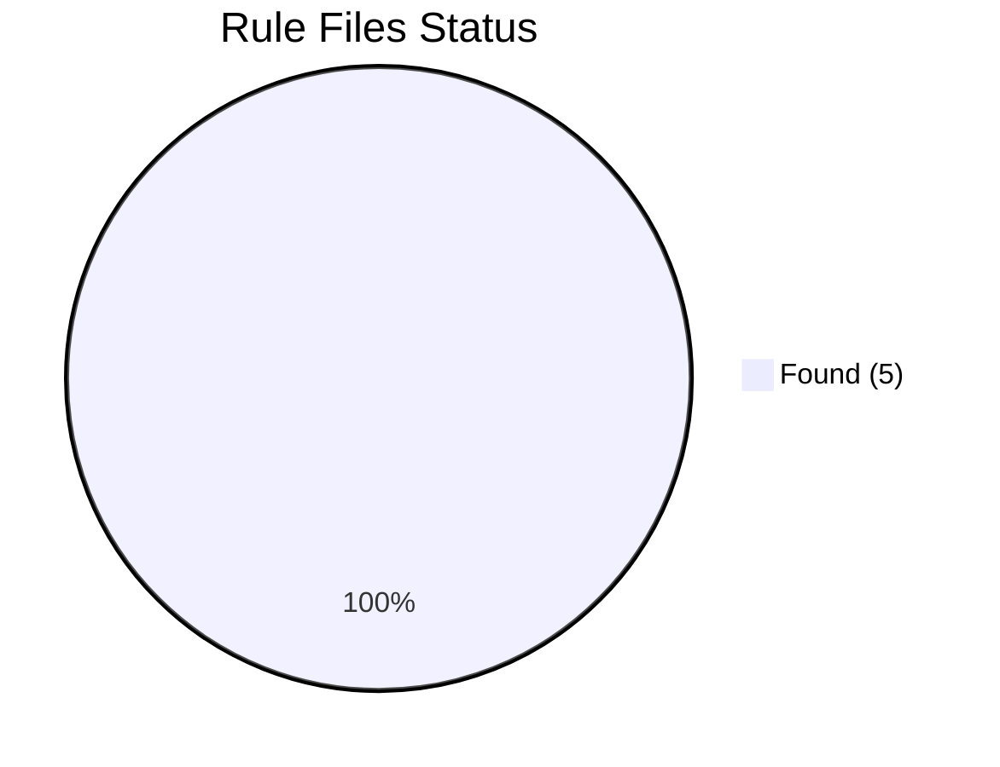

# 🔄 Inspector AI Rule Sync Visualization

**実行時刻**: 2025/7/27 7:38:49

## 📊 Sync Process Flow

## 📈 File Status Overview

## 📋 Detailed File Status

| File | Status | Size | Hash | Last Modified |
|------|--------|------|------|---------------|
| MANAGEMENT_AI_RULES[超重要L10].md | ✅ Found | 3459B | `18cf4ab1...` | 2025/7/26 10:08:04 |
| AI_MUTUAL_MONITORING_SYSTEM[超重要L10].md | ✅ Found | 6730B | `275aff2e...` | 2025/7/27 6:35:03 |
| INSPECTOR_AI_MANUAL[超重要L10].md | ✅ Found | 8145B | `29148ceb...` | 2025/7/27 6:41:52 |
| MANAGEMENT_AI_TEAM_STRUCTURE[超重要L10].md | ✅ Found | 5916B | `9ea6b739...` | 2025/7/26 22:30:09 |
| REFLECTION_MISTAKE_SAMPLES[超重要L10].md | ✅ Found | 8258B | `6fb52f49...` | 2025/7/26 22:57:09 |
