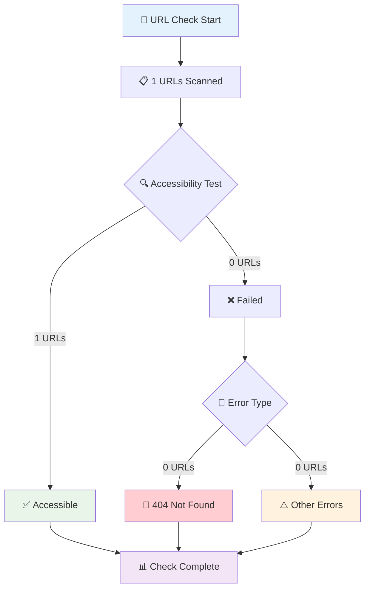
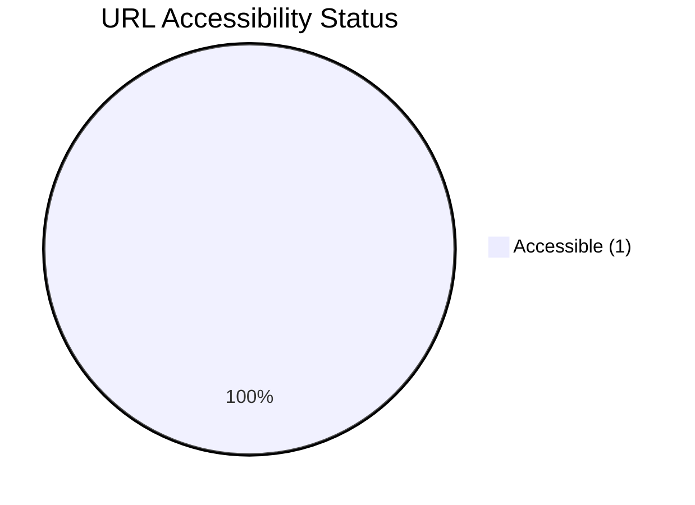

# 🌐 URL Accessibility Check Report

**チェック実行時刻**: 2025/7/27 7:16:22

## 📊 Overall Status Flow

## 📈 Status Distribution

## 🎯 Performance Metrics

| Metric | Value | Status |
|--------|-------|--------|
| Total URLs | 1 | 📊 |
| Accessible | 1 | ✅ |
| Failed | 0 | ✅ |
| 404 Errors | 0 | ✅ |
| Success Rate | 100.0% | 🎯 |

